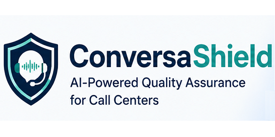

# ConversaShield



ConversaShield is a call-center quality assurance system submitted to the Google DeepMind Gemma 4 Good Hackathon.

It demonstrates how a local Gemma model can evaluate call-center conversations and produce structured QA results for supervisors, compliance teams, and B2B customer-support operations.

## What ConversaShield Does

ConversaShield processes call transcripts and uses Gemma to evaluate agent performance.

It focuses on:

- agent politeness
- correct opening and closing
- campaign or company presentation
- offer explanation
- objection handling
- compliance risk detection
- structured QA scoring
- supervisor-ready CSV output

## Hackathon Submission Notice

This repository is a public hackathon edition.

Production infrastructure and deployment-specific modules are not included in this public version.

The production version may include additional components such as:

- call-center optimized audio preprocessing
- advanced speech-to-text processing
- production deployment logic
- Solana-based monetization flows
- customer-specific configuration
- anti-abuse and access-control mechanisms
- commercial reporting integrations

The purpose of this repository is to demonstrate the Gemma-based QA reasoning layer and the overall ConversaShield data flow.

## Why Gemma

ConversaShield uses Gemma locally through Ollama for private, structured, repeatable QA analysis.

This is important for call-center environments because call data can be sensitive. A local model workflow allows experimentation with privacy-conscious AI evaluation without depending entirely on external hosted inference.

Default model used in this public edition:

```text
gemma3:12b